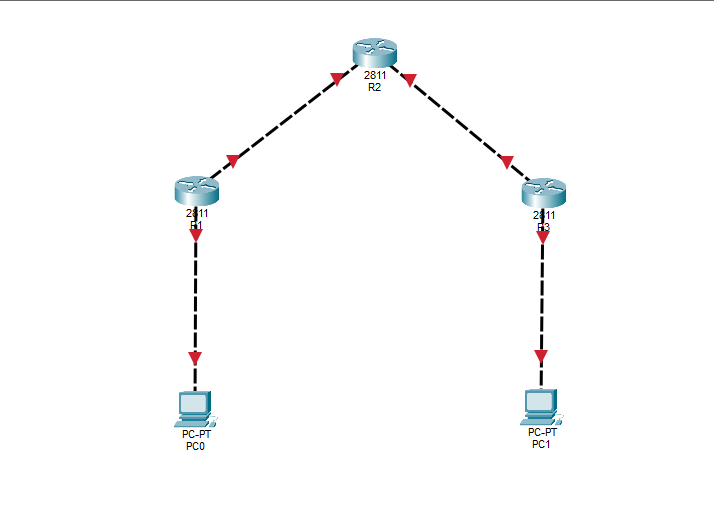

# Belajar Tunnel dan NAT

Repositori ini berisi konfigurasi Cisco untuk mempelajari konsep **Tunneling** dan **Network Address Translation (NAT)** dengan implementasi routing RIP.

## 📋 Daftar Isi

- [Topologi Jaringan](#topologi-jaringan)
- [Deskripsi Router](#deskripsi-router)
- [Detail Konfigurasi](#detail-konfigurasi)
- [Petunjuk Implementasi](#petunjuk-implementasi)

---

## 🌐 Topologi Jaringan



---

## 🔧 Deskripsi Router

### **R1 (Router 1) - Gateway Utama**

**File:** `R1`

Router 1 berfungsi sebagai gateway utama yang menghubungkan jaringan lokal dengan jaringan lain melalui NAT dan tunneling.

**Interface:**
- `f0/0`: 192.168.1.1/24 (LAN lokal)
- `f0/1`: 10.10.10.1/24 (Link ke R2)
- `tunnel 0`: 172.168.100.1/24 (Tunnel ke R3)

**Fitur:**
- ✅ Routing RIP untuk propagasi rute
- ✅ NAT overload pada interface f0/1
- ✅ GRE Tunnel ke R3 melalui R2
- ✅ Routing statis untuk traffic tunnel

---

### **R2 (Router 2) - Transit Router**

**File:** `R2`

Router 2 bertindak sebagai router transit yang menghubungkan R1 dan R3, serta menjalankan RIP routing untuk propagasi dinamis.

**Interface:**
- `f0/0`: 10.10.10.2/24 (Link ke R1)
- `f0/1`: 11.11.11.1/24 (Link ke R3)

**Fitur:**
- ✅ Routing RIP untuk kedua segment
- ✅ Menjadi perantara komunikasi antar router

---

### **R3 (Router 3) - Gateway Sekunder**

**File:** `R3`

Router 3 adalah gateway sekunder yang memiliki konfigurasi mirror dengan R1, menghubungkan jaringan 192.168.2.0/24.

**Interface:**
- `f0/1`: 11.11.11.2/24 (Link ke R2)
- `f0/0`: 192.168.2.1/24 (LAN lokal)
- `tunnel 0`: 172.168.100.2/24 (Tunnel ke R1)

**Fitur:**
- ✅ Routing RIP untuk propagasi rute
- ✅ NAT overload pada interface f0/1
- ✅ GRE Tunnel ke R1 melalui R2
- ✅ Routing statis untuk traffic tunnel

---

## 📝 Detail Konfigurasi

### **R1 - Konfigurasi Lengkap**

```cisco
! --- Interface Configuration ---
interface f0/1
 ip address 10.10.10.1 255.255.255.252
 no shutdown

interface f0/0
 ip address 192.168.1.1 255.255.255.0
 no shutdown

! --- RIP Routing ---
router rip
 network 10.10.10.0
 network 192.168.1.0

! --- NAT Configuration ---
ip route 0.0.0.0 0.0.0.0 10.10.10.2
access-list 1 permit any
ip nat inside source list 1 interface f0/1 overload

interface f0/1
 ip nat outside

interface f0/0
 ip nat inside

! --- Tunnel Configuration ---
interface tunnel 0
 ip address 172.168.100.1 255.255.255.0
 tunnel source f0/1
 tunnel destination 11.11.11.2

! --- Static Route for Tunnel ---
ip route 192.168.2.0 255.255.255.0 172.168.100.2
```

### **R2 - Konfigurasi Lengkap**

```cisco
! --- Interface Configuration ---
interface f0/0
 ip address 10.10.10.2 255.255.255.252
 no shutdown

interface f0/1
 ip address 11.11.11.1 255.255.255.252
 no shutdown

! --- RIP Routing ---
router rip
 network 10.10.10.0
 network 11.11.11.0
```

### **R3 - Konfigurasi Lengkap**

```cisco
! --- Interface Configuration ---
interface f0/1
 ip address 11.11.11.2 255.255.255.252
 no shutdown

interface f0/0
 ip address 192.168.2.1 255.255.255.0
 no shutdown

! --- RIP Routing ---
router rip
 network 11.11.11.0
 network 192.168.2.0

! --- NAT Configuration ---
ip route 0.0.0.0 0.0.0.0 11.11.11.1
access-list 1 permit any
ip nat inside source list 1 interface f0/1 overload

interface f0/1
 ip nat outside

interface f0/0
 ip nat inside

! --- Tunnel Configuration ---
interface tunnel 0
 ip address 172.168.100.2 255.255.255.0
 tunnel source f0/1
 tunnel destination 10.10.10.1

! --- Static Route for Tunnel ---
ip route 192.168.1.0 255.255.255.0 172.168.100.1
```

---

## 🚀 Petunjuk Implementasi

### **1. Persiapan**
-DONGLOAD PKA di /images.pka

### **2. Konfigurasi R1**
Masukkan semua perintah dari file `R1`


### **3. Konfigurasi R2**
Masukkan semua perintah dari file `R2`

### **4. Konfigurasi R3**
Masukkan semua perintah dari file `R3`

### **5. Verifikasi**

**Periksa status interface:**
```bash
show interface brief
show interface tunnel 0
```

**Periksa routing RIP:**
```bash
show ip route rip
show ip protocols
```

**Periksa NAT:**
```bash
show ip nat statistics
show ip nat translations
```

**Test konektivitas:**
```bash
ping 192.168.2.1 
traceroute 192.168.2.0 
```

---

## 📚 Konsep Pembelajaran

### **NAT (Network Address Translation)**
- Mengonversi alamat IP private menjadi public
- Menghemat penggunaan alamat IP public
- Memberikan lapisan keamanan dasar

### **Tunneling**
- Membuat jalur komunikasi virtual melalui jaringan yang ada
- GRE (Generic Routing Encapsulation) mengenkapsulasi paket dalam protokol lain
- Memungkinkan komunikasi antar jaringan yang tidak langsung terhubung

### **RIP (Routing Information Protocol)**
- Protocol routing dinamis yang berbasis hop-count
- Relatif sederhana namun tidak optimal untuk jaringan besar
- Berguna untuk pembelajaran fundamental routing

---

## 📄 Lisensi

Repository ini dibuat untuk tujuan pembelajaran.

---

## 👨‍💻 Kontribusi

Untuk pertanyaan atau saran, silakan buka issue atau hubungi penulis.

**Selamat belajar networking! 🎓**
